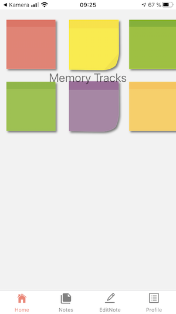
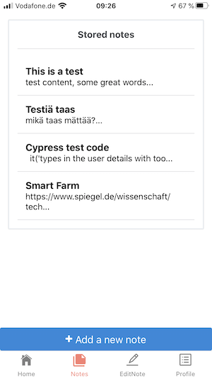
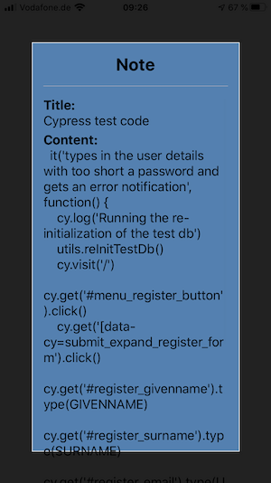
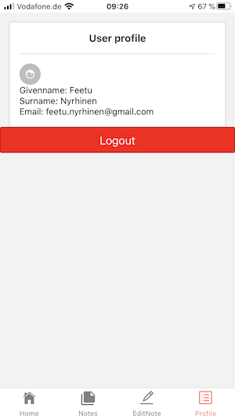

# Helsingin yliopiston Full Stack Web Development -kurssin harjoitustyö "Muistijäljet"

Kts. https://courses.helsinki.fi/en/aytkt21010/129098202 ja https://github.com/fullstackopen-2019/misc/blob/master/projekti.md
Tämä sovellus on rakennettu Full Stack Web Development -kurssille. Projekti on jaettu kahteen kolmeen eri repositoryyn: [ensimmäisessä Backend-toteutus](https://github.com/minzen/fullstack_harjoitustyo_backend) ja [toisessa normaali Frontend](https://github.com/minzen/fullstack_harjoitustyo_frontend) ja [kolmannessa](https://github.com/minzen/fullstackharjoitustyoreactnative) (tämä) kokeellinen React Native -toteutus.

## Yleistä

"Muistijäljet"-sovellus on tarkoitettu käyttäjälle, joka käyttää monia päätelaitteita ja haluaa päästä helposti käsiksi aiemmin tallennettuihin tietoihin. Sovellus mahdollistaa käyttäjälle helpon tavan tallentaa/linkittää merkityksellistä sisältöä (esim. tärkeät muistiinpanot, linkit resursseihin, joihin käyttäjä haluaa palata myöhemmin, mutta juuri kyseisellä hetkellä ei ole aikaa tai halua tehdä sitä). Kunkin tallennettavan tiedon yhteyteen tallennetaan asiasanoja, joiden mukaan sisältöjä luokitellaan ja on mahdollista hakea myöhemmin. Fronend huolehtii tietojen hakemisesta ja näyttämisestä Backendin tarjoaman API:n kautta.

## React Native -toteutus

React Native toteuttaa yksinkertaisen frontendin mobiililaitteille. Mobiilisovellus käyttää ApolloServer-toteutuksessa pyörivää API:a muistiinpanojen noutamiseen, tallentamiseen, muuttamiseen, sekä käyttäjien hallinnointiin ja autentikointiin.

Toteutuksessa on käytetty apuna react-, react-native ja apolloserver ja -client -riippuvaisia kirjastoja. Käyttöliittymän ulkonäön parantamisessa on käytetty apuna normaaleja CSS-tyylejä sekä react-native-elements-komponentteja sekä EvilIcons-kokoelmaa.

## Buildaus ja ajo

### Järjestelmävaatimukset

- nodejs (esim. v.10.19.0), yarn/npm asennettu
- Expo
- Backend-toteutus ajossa palvelimella (esim. localhostilla)

### Sovelluksen buildaus

- suorita komento _yarn install_ vaadittujen riippuvuuksien asentamiseksi
- Tällä hetkellä ei ole React Native -sovelluksesta tuotantoversiota vaan ainoastaan kehitysversio, jota ajetaan Expo.io -sovelluksessa.
- Suorittamalla komennon _expo start_ käynnistyy Expo-palvelimen paikallinen instanssi ja sovellusta voidaan testata simulaattorissa tai oikeassa iOS- tai Android-laitteessa.

## Käytetyt teknologiat

- React JS
- React Native
- GraphQL + Apollo Client ja muita Apollo-kirjastoja
- React Native Elements
- React Navigation

## Projektin testaus

Sovellusta voidaan ajaa esim. [Expo-sovelluksen](https://expo.io/tools) avulla. Komento
`expo start` käynnistää suorituksen palvelimelle, johon voidaan muodostaa yhteys puhelimen applikaation avulla.

## Kuvakaappauksia

## Työaikakirjanpito

[Työaikakirjanpito](https://github.com/minzen/fullstack_harjoitustyo_backend/blob/master/tyokirjanpito.md)
